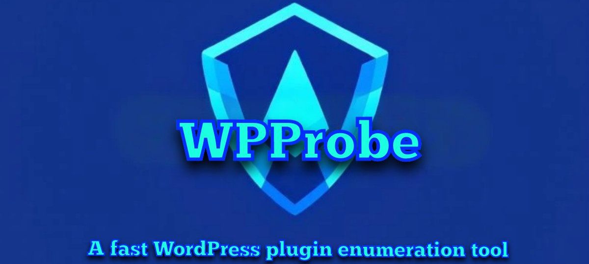
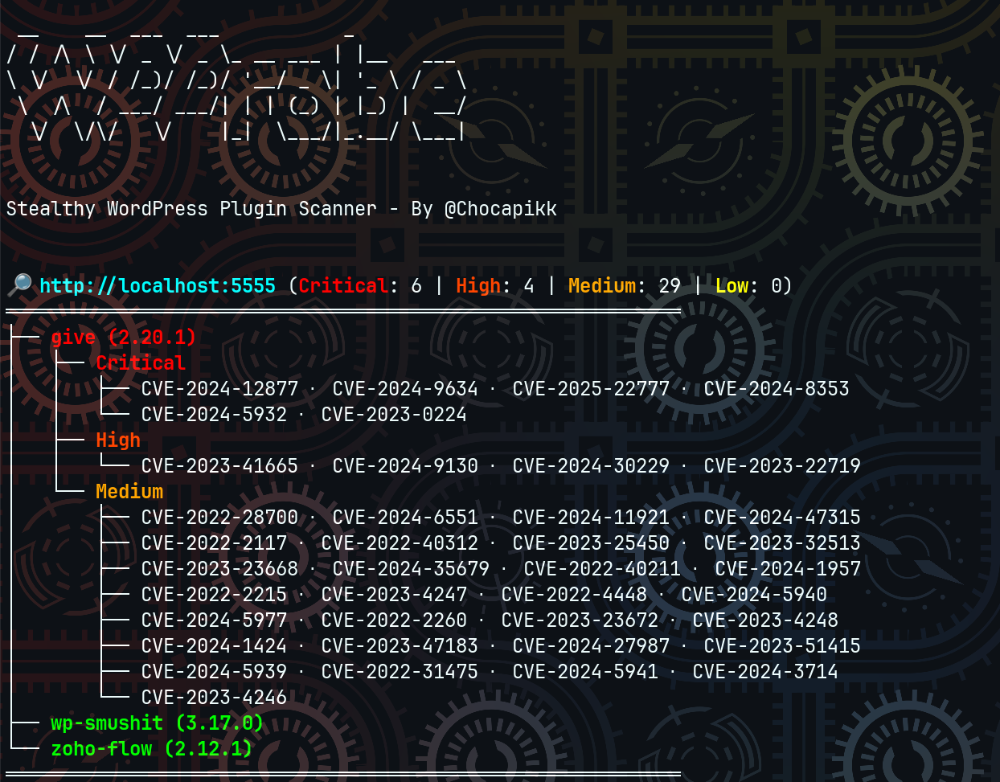

**"Because why scan blind when WordPress exposes itself?"**

---



[](https://github.com/Chocapikk/wpprobe/actions/workflows/go.yml)
[](https://github.com/Chocapikk/wpprobe/releases/latest)

# WPProbe

A fast WordPress plugin scanner that detects installed plugins via REST API enumeration and maps them to known vulnerabilities. Over 3000 plugins detectable without brute-force, thousands more with it.

## Quick Start

```bash
go install github.com/Chocapikk/wpprobe@latest
wpprobe update-db
wpprobe scan -u https://example.com
```

## Scanning Modes

| Mode | Method | Stealth | Coverage |
|------|--------|---------|----------|
| `stealthy` (default) | REST API endpoint matching | High | 3000+ plugins |
| `bruteforce` | Direct directory checks | Low | 10k+ plugins |
| `hybrid` | Stealthy first, then brute-force | Medium | Maximum |

```bash
wpprobe scan -u https://example.com --mode stealthy
wpprobe scan -u https://example.com --mode bruteforce
wpprobe scan -u https://example.com --mode hybrid
```

## Installation

```bash
# Go (requires 1.22+)
go install github.com/Chocapikk/wpprobe@latest

# Nix
nix-shell -p wpprobe

# Docker
docker run -it --rm wpprobe scan -u https://example.com

# From source
git clone https://github.com/Chocapikk/wpprobe && cd wpprobe && go build -o wpprobe
```

<details>
<summary>Docker with file mounting</summary>

```bash
# Mount current directory for input/output files
docker run -it --rm -v $(pwd):/data wpprobe scan -f /data/targets.txt -o /data/results.csv

# Persist vulnerability databases
docker run -it --rm \
  -v $(pwd):/data \
  -v wpprobe-config:/config \
  wpprobe scan -f /data/targets.txt -o /data/results.json

# Update databases
docker run -it --rm \
  -v wpprobe-config:/config \
  -e WPSCAN_API_TOKEN=your_token \
  wpprobe update-db
```

</details>

## Usage

### Scanning

```bash
# Single target
wpprobe scan -u https://example.com

# Multiple targets with threading
wpprobe scan -f targets.txt -t 20

# Custom options
wpprobe scan -u https://example.com \
  --header "User-Agent: CustomAgent" \
  --proxy http://proxy:8080 \
  --rate-limit 10 \
  --no-check-version

# Output formats
wpprobe scan -u https://example.com -o results.csv
wpprobe scan -u https://example.com -o results.json
```

### Vulnerability Database

```bash
# Update databases (Wordfence is free, WPScan requires Enterprise API token)
wpprobe update-db

# Search vulnerabilities
wpprobe search --cve CVE-2024-1234
wpprobe search --plugin woocommerce
wpprobe search --severity critical
wpprobe search --auth Unauth
wpprobe search --title "SQL Injection" --details

# Database statistics
wpprobe list
```

Set `WPSCAN_API_TOKEN` for WPScan database updates (Enterprise plan only). Wordfence database is free and unlimited.

### Self-Update

```bash
wpprobe update
```

## How It Works

**Stealthy mode** queries exposed REST API routes (`?rest_route=/`) and matches discovered endpoints against a precompiled database of known plugin signatures. This generates minimal requests and avoids detection by WAFs.

**Brute-force mode** checks plugin directories directly via GET requests. A 403 response confirms the plugin exists (directory listing forbidden). A 200 response is validated by checking for `readme.txt` in the directory listing to avoid false positives from WordPress instances that return 200 for all paths.

**Hybrid mode** combines both: stealthy first for low-noise detection, then brute-force for remaining plugins.

Detected plugins are correlated with known CVEs from Wordfence and WPScan databases, with version range matching to identify vulnerable installations.

<details>
<summary>Output format examples</summary>

**CSV:**
```csv
URL,Plugin,Version,Severity,AuthType,CVEs,CVE Links,CVSS Score,CVSS Vector,Title
http://example.com,give,2.20.1,critical,Unauth,CVE-2025-22777,https://www.cve.org/CVERecord?id=CVE-2025-22777,9.8,CVSS:3.1/AV:N/AC:L/PR:N/UI:N/S:U/C:H/I:H/A:H,GiveWP <= 3.19.3 - Unauthenticated PHP Object Injection
```

**JSON:**
```json
{
  "url": "http://example.com",
  "plugins": {
    "give": [
      {
        "version": "2.20.1",
        "severities": [
          {
            "critical": [
              {
                "auth_type": "Unauth",
                "vulnerabilities": [
                  {
                    "cve": "CVE-2025-22777",
                    "cvss_score": 9.8,
                    "title": "GiveWP <= 3.19.3 - Unauthenticated PHP Object Injection"
                  }
                ]
              }
            ]
          }
        ]
      }
    ]
  }
}
```

</details>

## Limitations

- **Stealthy**: Some plugins don't expose REST API endpoints. Disabled or hidden plugins may not be detected.
- **Brute-force**: Generates many requests, may trigger WAFs or rate limits. Limited by wordlist coverage.
- **Hybrid**: Slower than pure stealthy due to the brute-force phase.

## Environment Variables

| Variable | Description |
|----------|-------------|
| `WPSCAN_API_TOKEN` | WPScan Enterprise API token for database updates |
| `HTTP_PROXY` / `HTTPS_PROXY` / `ALL_PROXY` | Proxy configuration |
| `NO_PROXY` | Proxy bypass rules |

## Contributing

Contributions are welcome. Please open an issue or submit a pull request.

## License

MIT License - see LICENSE file for details.

## Credits

Developed by [@Chocapikk](https://github.com/Chocapikk).

## Stats

<a href="https://star-history.com/#Chocapikk/wpprobe&Date">
  <picture>
    <source media="(prefers-color-scheme: dark)" srcset="https://api.star-history.com/svg?repos=Chocapikk/wpprobe&type=Date&theme=dark" />
    <source media="(prefers-color-scheme: light)" srcset="https://api.star-history.com/svg?repos=Chocapikk/wpprobe&type=Date" />
    
  </picture>
</a>
